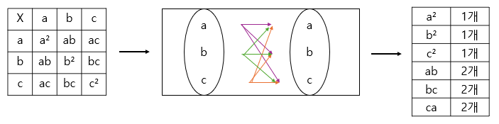

# 고1 기준 공식의 이해

  

# 고3 확통 기준 공식의 이해

 

-(a+b+c)^3
-(a+b)^2, (a+b)^3, (a+b)^4
-(a-b)^2, (a-b)^3, (a-b)^4
-(x-a)(x-b)(x-c), (x-a)(x-b)(x-c)(x-d)

# 3변수 식 전개 빠르게 하는 법

(ab+bc+ca)^2의 전개공식 활용 같이 3변수 식에서는 머리보다 쓰는 속도가 현저히 느린 경우가 발생한다.
a+b+c, ab+bc+ca를 나만의 기호로 써서 활용하여 식을 전개하는 연습을 해보자.

Q. 다음 식을 S1=a+b+c, S2=ab+bc+ca, S3=abc로 표기하여 전개하시오.

- a^2+b^2+c^2
- (ab+bc+ca)^2
- (a^2)(b^2)+(b^2)(c^2)+(c^2)(a^2)
