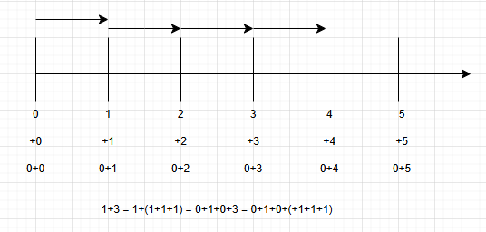
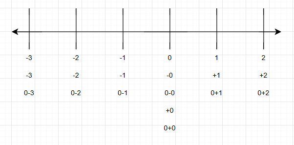

 

우선 수 체계부터 보자. "2는 +2와 등호 관계이고 0+2와 등호 관계이다" 를 약속의 단위로 쪼개보면 "2, +, 0, 같다"의 약속이 있다. 숫자 2는 두 개라는 뜻이고, +는 양의 방향 (즉, 일반적인 방향) 이라는 뜻이며, 0은 "없다"를 나타내는 크기의 숫자이고 (따라서 어떤 물건이 0개 있다는 말은 그 물건이 없다는 뜻이다) , 등호(=)는 단어 "같다"보다 더 엄격한 의미로서 대략 "완전히 같아 서로 대체할 수 있다" 정도의 의미이다. 

그 다음은 0,1,2,3,4,5의 의미하는 갯수이다. 손가락을 접었다 펴보며 0부터 5까지의 수를 양 옆으로 한 칸씩 이동하는 놀이를 가상으로 또는 직접 해보자. 이 놀이를 통해 알 수 있듯이 수 체계는 불연속적 크기 관계를 가진다. 또한 이 놀이에 따르면 수직선의 화살표방향이 양방향인 것이 더 맞다는 것을 직관적으로 느낄 수 있으나, 해당 부분은 위의 그림이 아닌 아래의 그림을 통해 음수와 같이 제시하였으니 조금만 더 기다려주길 바란다.

다음으로는 1=0+1에 대한 설명이다. x가 1개 있다는 것은 x가 0개 있는 (즉, 없는) 상태에서 하나가 더해졌다는 것을 x의 위치를 옮기는 사고실험을 통해 알 수 있다. 이 때 x는 도자기, 쌀알, 코끼리 등 갯수가 확인되는 것이면 무엇이든 성립한다.

다음으로는 3=1+1+1의 설명이다. 어떤 것이 3개 있다는 것은 하나에 두개가 더 있다는 것이고 이 때의 두 개는 하나와 하나의 합임을 위쪽에서 언급한 가상의 손가락 접기 놀이에서 확인하였다. 이처럼 1,2,3,4,5,6,7,8,9,0의 기호는 세계 공통의 기호이다. 또한 다음과 같은 설명도 가능하다. 숫자 3은 1을 세번 모았다는 뜻으로 설명할 수 있는데, 여기서 모으는 것이 더하기 기호(+)이다. 따라서 +3=+1+1+1이다.

마지막으로, 이 모든 것을 익히고 난 후 하나의 그림을 통해 이 모든 것이 설명되고 맞아떨어지는 이해의 감동을 경험하라. 정말이지 이것 참 말 되는 이야기이지 않은가? 이어서 위쪽에서 언급한 음수의 그림을 아래에 제시한다.

 

우선 0만 밑으로 길쭉한 것은 알다시피 등호의 성질이다. A=B=C=D=E이면 A=D=E=B=C임으로 0에서는 위쪽 "수직선의 반직선" 이 들어간 그림과 같은 정보를 "수직선" 이 들어간 그림이 담고 있다. 

이제 음의 방향인 음수를 받아들일 시간이다. 혹시 통장 잔액에 마이너스가 찍힌 통장이 있는가? 그거랑 이거랑 같은거 맞다. 탁자 위에 사과가 -3개 있다는 것은 3개를 더 채워야 없는 상태(0개)로 돌아간다는 뜻임으로 사과 3개를 준비해 그 사과의 주인에게 가져다 주어야 한다. 그럼 사과 3개의 주인은 누구일까? 맞다. 바로 사과가 -3개 있는 집에 그러한 -3이라는 표시를 하면서 그 집에 사과 3개를 가져다 준 사람이 주인이다. 그래서 -는 +와 달리 일반적인 양의 방향이 아니라 음의 방향이고, 2와 +2는 의미가 같지만 2와 -2는 의미가 다르다. 

여기까지 와보니 0의 특징이 하나 더 보인다. 바로 +0 = -0이라는 점이다. 통장 잔액이 0원인 대출통장은 대출이 발생하지 않은것으로 간주하여 은행이 대출이자를 메기지 않는다. 은행은 이를 명시하지 않지만, 대신 대출금리를 표현할 때 % 단위를 쓴다. 대출 금액에 정비례해 이자를 메기겠다는 것이다. 따라서 오직 -0원의 마이너스통장만 가진 사람은 오직 +0원의 계좌잔액만 가진 사람과 정확히 같은 금액을 가지고 있다고 할 수 있다.

이제 이 수직선에서 양수와 음수를 넘나들며 화살표를 그리고 계산하여 수 체계의 자연수와 0 (수학과에서는 통틀어 자연수) 에서 음수까지의 확장을 납득해보는 것은 개인의 몫으로 남긴다.
