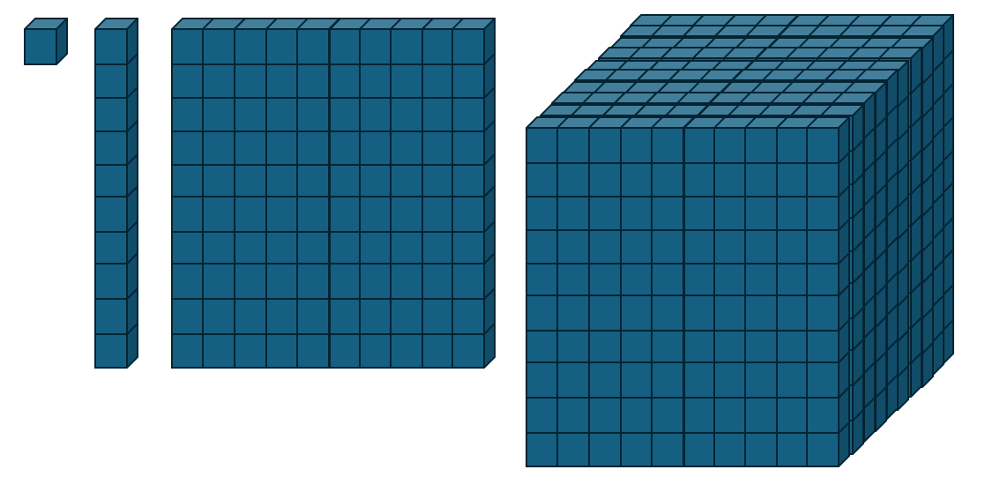
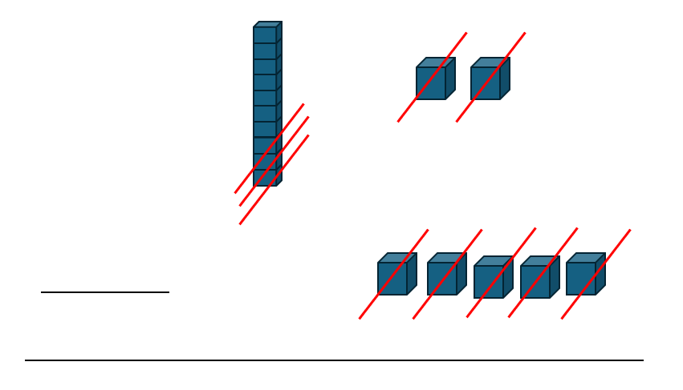
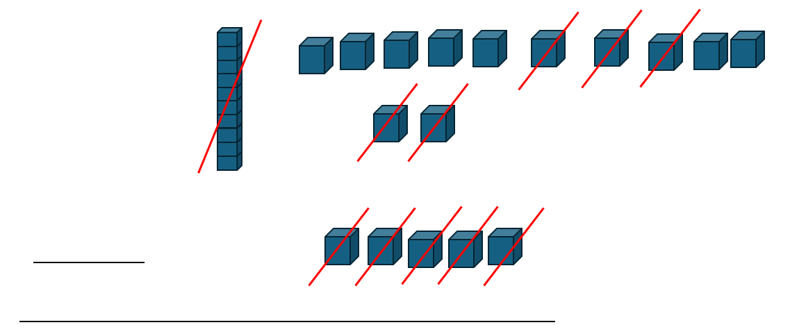
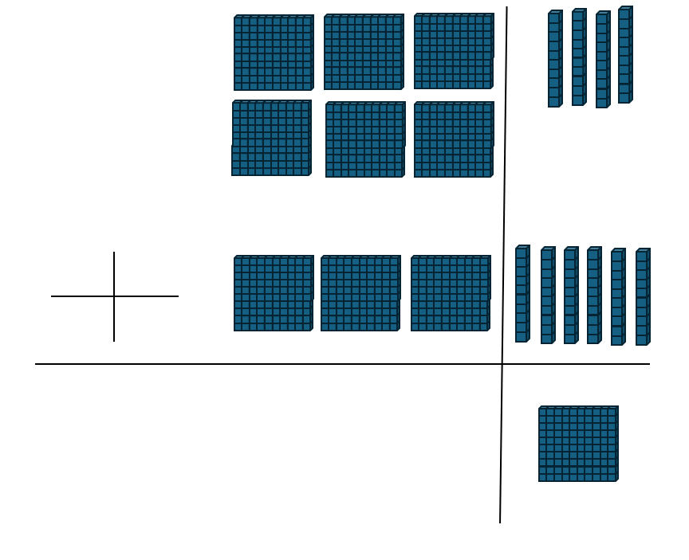
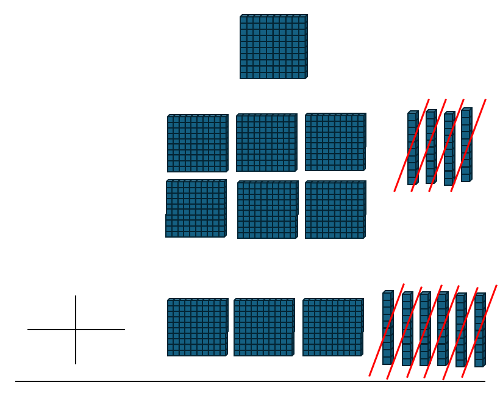

회사에서 일하면서 종이에다 펜으로 숫자계산하고 있으면 그 사람을 고용한 사장은 그만큼 기대치가 낮다는 뜻일 것이다. 이처럼 실생활에서는 컴퓨터와 핸드폰 등등이 대신해줌에도 불구하고, 받아올림과 받아내림의 원리는 반드시 알아야 한다고 개인적으로 생각한다. 여기서는 10진법 소개 후 바로 12-5=7과 640+360=1000을 그림으로 이해해본다.

10진법에 대해 알아보자. 손가락이 10개가 아닌 사람은 장애인으로 분류될 정도로 사람들은 다들 10개의 손가락을 가지고 산다. 양 손의 손가락 열 개를 하나씩 접어보며 1부터 10까지의 숫자를 세는 사고실험을 해보자(직접 해봐도 좋다). 이처럼 일의자리가 9로 꽉 차 있음에도 불구하고 하나를 더하면 10개가 묶여 한 덩어리로 된다. 이를 시각적으로 보일 수 있도록 이미지를 준비했다.

순서대로 1,10,100,1000이다. 각각 일의자리, 십의자리, 백의자리, 천의자리가 1이다. 이처럼 10개씩 모일때마다 그 10개를 한 자릿수 올린 하나로 둔다. 이게 바로 10진법이다. 2진법, 3진법, 60진법도 모두 같은 원리이다. 이제 12-5=7을 해보자.

익숙한 형태보다 더 직관적이지만, 칸 하나하나가 잘 보이지 않는다, 그래서 10의 자리 1을 1의 자리 10으로 바꾸는 과정을 거친다. 바로 아래 그림처럼.

이제 640+360=1000을 해보자.

맞다. 100이 10개니까 1000이다. 그리고 이것도 뻴셈처럼 일반화시킬 수 있다. 바로 이렇게.

다양한 진법에서의 받아올림과 받아내림도 원리는 동일하다.
