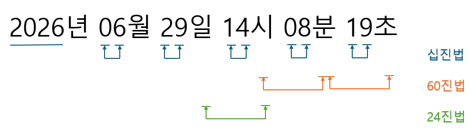

이 리포지토리의 특성상 아날로그시계 보는 법 학습 대신 시간과 진법에 대해 안내합니다.

다음으로 다양한 시각 표기법 (주로 "시간 표기법"이라 불림) 을 제시합니다.

- 오전3시
- pm 3:00
- 한국 표준시 (KST, UTC+9) 2026년 7월 1일 15:00
- GMT+9 2026년 7월 1일 15:00
- 뉴욕 써머타임 (EDT, UTC-4) 2026년 7월 1일 15:00

이처럼 같은 시각, 같은 순간이라도 상황과 목적에 따라 다양한 표기법을 사용할 수 있으며, 시간대와 써머타임을 고려한 표기형식은 전세계에서 오해없이 시각을 전달하기 위한 방법입니다.
